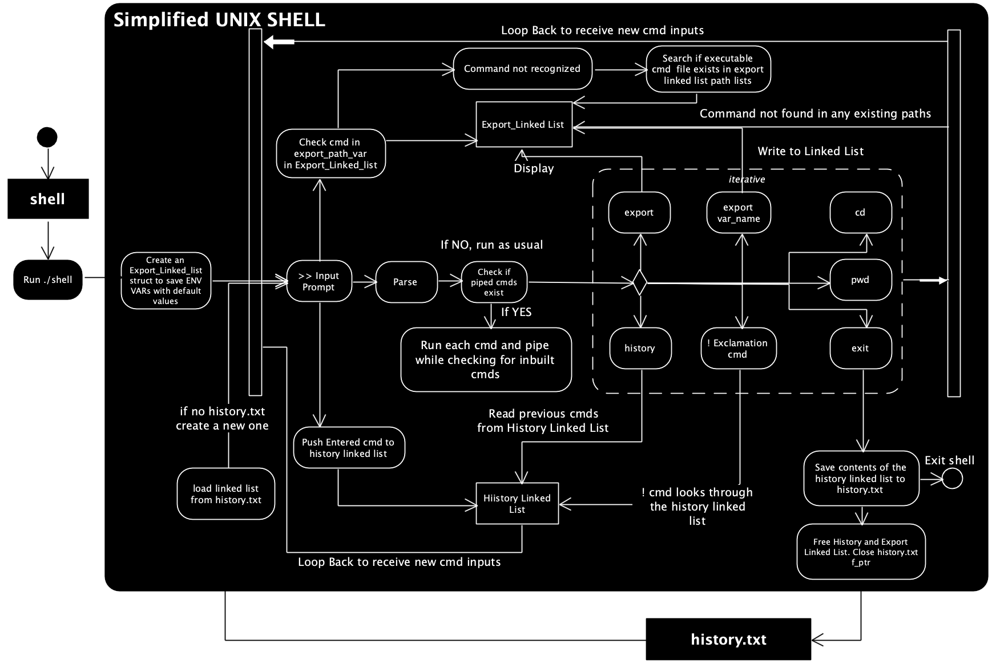

# unix_shell_simplified

[](https://travis-ci.org/SamSamhuns/unix_shell_simplified)
[](https://opensource.org/licenses/Apache-2.0)

This is an implementation of a simplified version of the UNIX SHELL using C. The current implementation includes the built-in `pwd`, `cd`, `history`, `export`, `!Num` and `exit` functions.

After adding the necessary paths to the `PATH` ENV var with the `export` function, external commands can be run as well.
I.e. after running `>> export PATH=/bin:/usr/bin`, external commands like `grep main < some_file` will function as normal.

Piping and input/output redirection have also been implemented

I.e. `cat < some_file | grep bar | grep foo > output.txt` will get the stdin for the `cat` command from some_file and pipe its stdout to `grep bar` which then pipes its output to `grep foo` and this stdout is finally saved to file `output.txt`.

The pseudocode logic for the pipe implementation is discussed below as well.

## Shell activity flow Diagram


## Requirements
This shell can only be built in Mac OS and Linux/UNIX based systems.

## Build (OSX & UNIX/Linux)
```shell
$ make all
```

## Run
```shell
$ ./shell
```

### Clean build artifacts
```shell
$ make clean
```

## Algorithm in pseudocode for pipe implementation in loops

```C
       run_piped_cmds_func():
         fork
         if parent
            check for exit status of child to return correct value
         else
           for pipe in cmd_pipes
            if there is a next cmd
                pipe(new_fds)
            else
                close all pipes
                exit(SUCCESS)

            fork
            if child
                if there is a previous cmd
                    dup2(old_fds[0], STDIN_FILENO)
                    close(old_fds[0])
                    close(old_fds[1])
                if there is a next cmd
                    close(new_fds[0])
                    dup2(new_fds[1], STDOUT_FILENO)
                    close(new_fds[1])
                exec cmd || die
            else
                if there is a previous cmd
                    close(old_fds[0])
                    close(old_fds[1])
                if there is a next cmd
                    old_fds[0] = new_fds[0]
                    old_fds[1] = new_fds[0]
           if there are multiple cmds
            close(old_fds[0])
            close(old_fds[1])
```

## Author
Samridha Shrestha

## Useful resources
1.  *UNIX Tutorial* <http://www.ee.surrey.ac.uk/Teaching/Unix/index.html>
2.  *Makefile Introduction Tutorial* <https://www.cs.colostate.edu/~cs157/LectureMakefile.pdf>
3.  *Makefile Intermediate Tutorial* <http://www.cs.colby.edu/maxwell/courses/tutorials/maketutor/>
